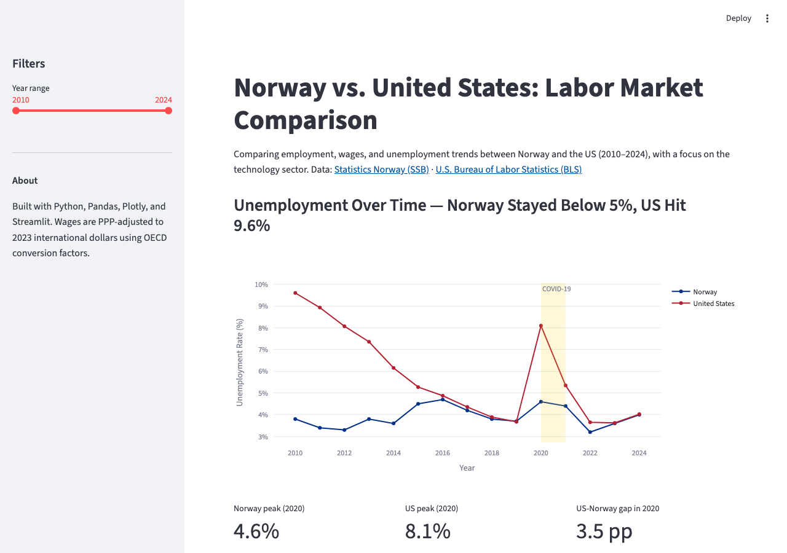

# Norway vs. United States: Labor Market Comparison Dashboard

**[Live Dashboard →](https://norway-us-labor-market.streamlit.app/)**

Interactive dashboard comparing employment, wages, and unemployment trends
between Norway and the United States (2010–2024), with a focus on the
technology sector. Built with real government data from Statistics Norway
(SSB) and the U.S. Bureau of Labor Statistics (BLS).

## Key Findings

1. **Unemployment resilience:** Norway's unemployment rate peaked at **4.6%** during COVID-19 (2020) vs. **8.1%** in the US — a gap of **3.5 percentage points** — and recovered to 3.2% by 2022, reflecting Norway's active labor market policies and social safety net.
2. **Tech wage gap (PPP-adjusted):** US tech workers earned **$100,658** annually vs. Norway's **$71,658** (PPP-adjusted) in 2023 — the US pays **40% more** in cash compensation, though Norway compensates through universal healthcare, 5-week paid leave, and lower out-of-pocket costs.
3. **Tech employment share:** **4.0%** of Norway's workforce is in the ICT sector vs. **1.9%** in the US (2023) — Norway has more than double the relative tech workforce share, with ~119,000 ICT workers out of a much smaller total labor force.
4. **Widening wage gap:** US tech wages grew **64%** between 2010–2024 (PPP-adjusted: $63,565 → $104,170) vs. Norway's **40%** ($53,383 → $74,631), meaning the compensation gap has been widening steadily over 14 years — not a one-time difference.

## Screenshot



## Data Sources

- [Statistics Norway (SSB)](https://data.ssb.no/api/v0/en/) — Employment, wages, and unemployment via SSB Open Data API (no API key required)
- [U.S. Bureau of Labor Statistics (BLS)](https://www.bls.gov/developers/) — IT employment, wages, and unemployment rate via BLS Public Data API v2
- [OECD](https://stats.oecd.org/) — Purchasing Power Parity (PPP) conversion factors for Norway

## Methodology

- **Industry mapping:** Norway NACE code J (Information & Communication) → US NAICS 51 (Information). Not a perfect match — see Limitations.
- **Wage normalization:** Norwegian monthly NOK wages converted to annual USD using OECD PPP factors (NOK ÷ PPP factor × 12). US hourly wages annualized at 2,080 hours/year.
- **Time aggregation:** Monthly BLS and SSB data averaged to annual figures for comparability.

## Resume Bullets

```
Norway–US Labor Market Dashboard | Python, PostgreSQL, Streamlit, Plotly, SSB API, BLS API

- Designed PostgreSQL star schema and ETL pipeline integrating Norwegian (SSB) and US (BLS)
  government labor data across 15 years and 4 industry sectors; normalized wages across
  currencies using OECD PPP conversion factors.
- Built interactive Streamlit dashboard with SQL-driven analysis (window functions: LAG,
  FIRST_VALUE, AVG OVER) revealing that US tech wages grew 64% vs. Norway's 40% from
  2010–2024, and that Norway's COVID-19 unemployment peak (4.6%) was 3.5pp below the US (8.1%).
- Integrated two real government REST APIs (Statistics Norway SSB, U.S. Bureau of Labor
  Statistics) with different data formats (JSON-stat, BLS v2), mapping ~119K Norwegian ICT
  workers to ~3M US IT workers using NACE-to-NAICS industry crosswalk.
```

## Tech Stack

Python · PostgreSQL · Streamlit · Plotly · Pandas · SQLAlchemy · SSB API · BLS API

## Project Structure

```
norway-us-labor-market/
├── app/dashboard.py          # Streamlit dashboard
├── src/
│   ├── fetch_ssb.py          # Norway data fetcher (SSB API)
│   ├── fetch_bls.py          # US data fetcher (BLS API)
│   ├── clean.py              # Data cleaning and normalization
│   ├── database.py           # PostgreSQL schema loading
│   └── analyze.py            # SQL analysis functions
├── sql/
│   ├── create_tables.sql     # Database schema DDL
│   └── queries.sql           # Analytical SQL queries
├── notebooks/exploration.ipynb   # EDA notebook
├── data/
│   ├── raw/                  # Raw API responses (gitignored)
│   └── processed/            # Cleaned CSVs
├── generate_sample_data.py   # Creates sample data for demo
├── run_pipeline.py           # Full data pipeline runner
└── requirements.txt
```

## How to Run

### Quick demo (no API keys needed)

```bash
# 1. Install dependencies
pip install -r requirements.txt

# 2. Generate sample data based on published statistics
python generate_sample_data.py

# 3. Launch the dashboard
streamlit run app/dashboard.py
```

### With real API data

```bash
# 1. Copy and fill in your credentials
cp .env.example .env
# Add your BLS API key (free registration at https://data.bls.gov/registrationEngine/)

# 2. Run the full pipeline
python run_pipeline.py

# 3. (Optional) Load into PostgreSQL
python run_pipeline.py --load-db

# 4. Launch the dashboard
streamlit run app/dashboard.py
```

### PostgreSQL setup (optional)

```bash
createdb norway_us_labor
psql norway_us_labor < sql/create_tables.sql
python src/database.py
```

## Limitations

- **Industry classification mismatch:** NACE J (Norway) includes publishing and broadcasting that are not in NAICS 51 (US). Sector-level comparisons are indicative.
- **PPP approximation:** OECD PPP factors are economy-wide averages. Tech workers in Oslo or San Francisco face different local costs than the national average.
- **Wage coverage gaps:** SSB wages cover full-time employees in registered enterprises; BLS IT wages may exclude some worker categories. Neither fully captures gig workers.
- **Annual aggregation:** Monthly COVID spike (US: 14.7% in April 2020) is smoothed in annual averages.

---

